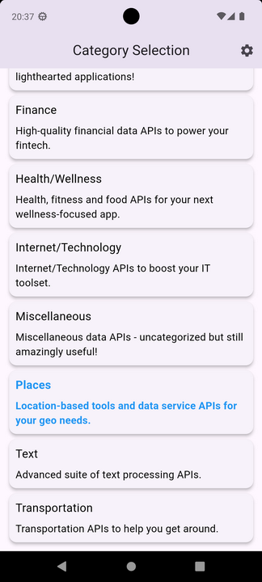
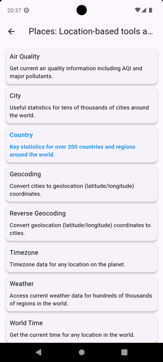
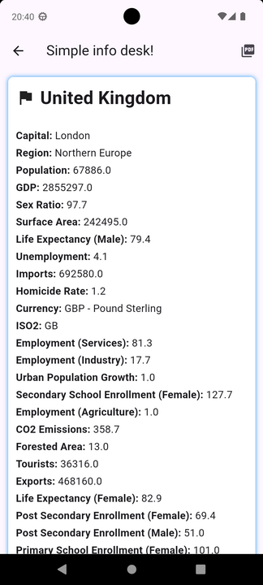
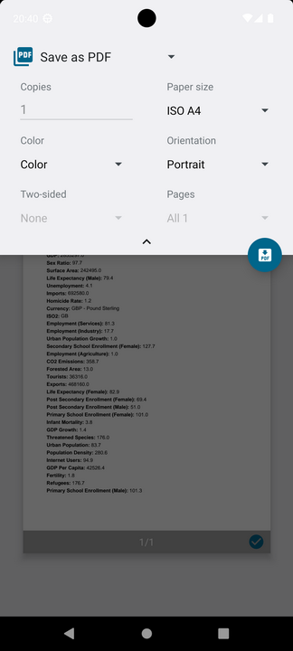
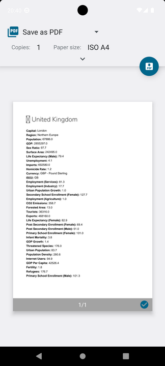
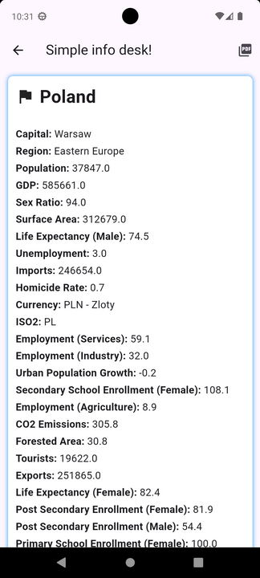

# Simple info desk

mastorramos@gmail.com

2024 (c) 

on Flutter!

Just a help desk :)

Experimental app in Flutter.
Microservices APIs are used.
Design and promotion stage step by step.
For now, only a version in English is expected (API capabilities).

Technologies and main dependencies used:
dio, dotenv, provider, flutter bloc, equatable

Просто справочное бюро :)
Экспериментальное приложение на Flutter.
Используются микросервисы API.
Этап проектирования и продвижения шаг за шагом.
Предполагается пока только версия на английском языке (возможности API).

Использовались технологии и основные зависимости:
dio, dotenv, provider, flutter bloc, equatable

